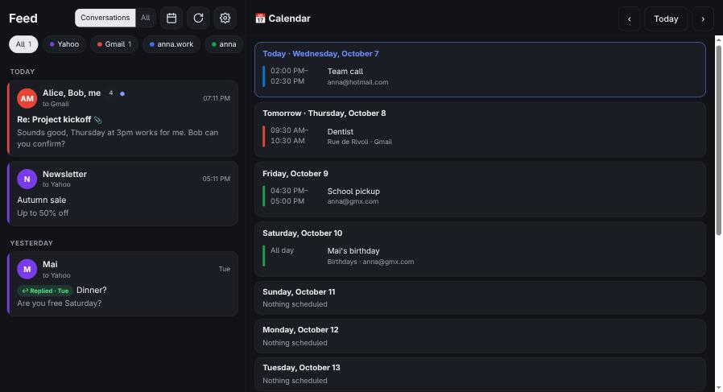
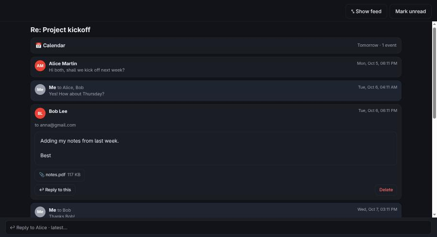
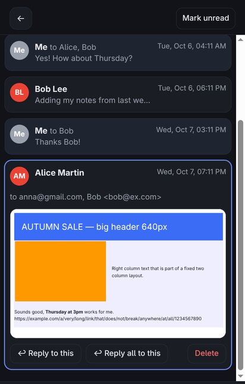

# Feed Mail

All your email accounts in one feed, with your calendars beside every email. It runs on your own small home server (a Raspberry Pi works well), and your mail stays on your providers' servers.

| Feed and calendar | A conversation | On a phone |
|---|---|---|
|  |  |  |

*Screenshots use made-up test data.*

## What it does

- **One feed for every inbox:** Gmail, Outlook/Hotmail, Yahoo, AOL and GMX, newest first, each account in its own colour.
- **Conversations:** messages are grouped into threads, including your own replies from the Sent folder. You can also switch to a plain list of every email.
- **Reply to any message in a thread,** not only the last one. Each reply is linked to the exact message it answers, so it threads correctly for everyone.
- **Search across all accounts.** Each provider searches its own servers: all of Gmail (Gmail's search words like `from:` and `has:attachment` work), all Outlook folders, and the inbox and Sent folders elsewhere.
- **Swipe to tidy up:** swipe a card left to delete (with Undo) or right to mark read/unread. On a computer, hover a card for the same buttons.
- **Write new emails** from any account, with address suggestions, Cc/Bcc and attachments.
- **Knows what you've replied to.** It reads your Sent folder, so replies made from any app count.
- **All your calendars in one place:** a two-week agenda, plus a strip in each email that shows the day it mentions ("Thursday at 3pm", "12 octobre"). Meeting invitations get clash warnings and Accept / Maybe / Decline buttons.
- **Installs on a phone like an app,** with back gestures, pull-to-refresh, and wide newsletters zoomed to fit the screen.
- **Private by design:** emails are fetched on demand and kept only in memory. Images from the internet are blocked until you ask for them. The only things written to disk are the sign-in credentials, encrypted.

## How it works

A small Node.js server talks to each provider:

| Provider | Mail | Calendar | Sign-in |
|---|---|---|---|
| Gmail | IMAP/SMTP | Google Calendar API | Google OAuth (your own Google Cloud project) |
| Outlook / Hotmail | Microsoft Graph | Microsoft Graph | Microsoft OAuth (your own Azure app registration) |
| Yahoo, AOL | IMAP/SMTP | CalDAV | App password |
| GMX | IMAP/SMTP | CalDAV | App-specific password (GMX needs a **separate** one for the calendar) |

The web page is a single file (`public/index.html`) with no build step.

## Setting it up

You need a machine that is always on (a Raspberry Pi 4 with Raspberry Pi OS Lite is plenty) and [Tailscale](https://tailscale.com) on it and on your phones and computers. Tailscale keeps the app private: only your own devices can reach it.

1. **Install Node.js 20+** and copy this folder to the server, then:
   ```sh
   npm ci --omit=dev
   ```
2. **Run it as a service** (example systemd unit, adjust user and paths):
   ```ini
   [Service]
   User=pi
   WorkingDirectory=/home/pi/feedmail
   ExecStart=/usr/bin/node server.js
   Environment=FEEDMAIL_DATA=/home/pi/feedmail-data
   Environment=PUBLIC_HOST=<your-machine>.<your-tailnet>.ts.net
   Restart=always
   ```
   It listens on `127.0.0.1:3000` only.
3. **Publish it inside your tailnet over HTTPS:**
   ```sh
   sudo tailscale serve --bg 3000
   ```
   Then open `https://<your-machine>.<your-tailnet>.ts.net`.
4. **First visit:** choose a password for the app, then add accounts under ⚙️ **Accounts**.
   - **Yahoo / AOL / GMX:** create an app password in the provider's security settings (for GMX, switch on IMAP first).
   - **Gmail:** create a Google Cloud project, enable the Google Calendar API, set up the consent screen, **publish it** (otherwise sign-ins expire after 7 days), and create a *Web application* OAuth client with the redirect URI `https://<host>/oauth/google/callback`. Paste the client ID and secret into the app.
   - **Outlook / Hotmail:** register an app in Azure (*Personal Microsoft accounts*) with the redirect URI `https://<host>/oauth/microsoft/callback`, create a client secret, and paste the client ID and the secret's **Value** into the app.
5. **On a phone:** open the address in Chrome (Android) or Safari (iPhone) and choose *Add to Home screen*.

## Notes and limits

- Each account shows its newest 50 inbox emails. Conversations include up to the last 300 sent messages.
- Attachments on Outlook replies are limited to 3 MB per file.
- The Azure client secret expires (24 months at most). Make a new one when the app says so.
- There's a *Shut down Pi* button in Accounts, for machines without a power button.

## License

MIT. See [LICENSE](LICENSE). Provided as is, with no warranty.

Built by Thuan Nguyen, who doesn't write code, together with [Claude Code](https://claude.com/claude-code).
